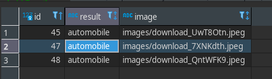

# FINAL


# _Installation_
```bash
pip install requirements.txt
python manage.py makemigrations
python manage.py migrate
```
#  _Usage_
```bash
python manage.py runserver
```

# _Examples_
Main page


# Prediction examples


# Database 



